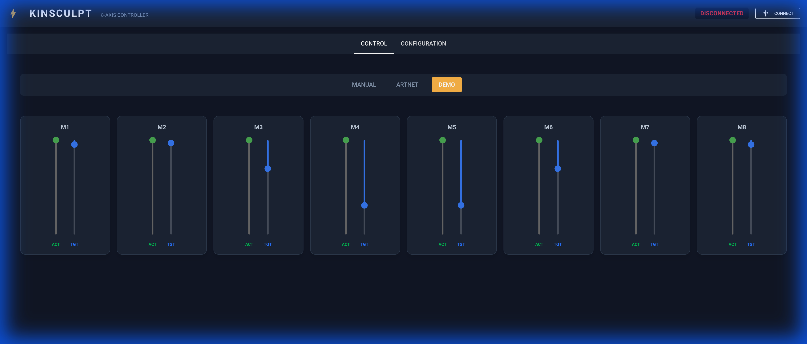

# Kinsculpt 8-Axis Motion Controller

**A hybrid Arduino + Raspberry Pi system for controlling 8 linear actuators with ArtNet, Manual, and Demo capabilities.**



## Overview

This project provides a robust, professional-grade control system for kinetic sculptures using 8 linear actuators (potentiometer feedback). 

It features:
- **Hybrid Architecture**: 
  - **Arduino Mega**: Handles low-level PID control, soft-start/stop, and safety limits.
  - **Raspberry Pi**: Runs the Python-based Web GUI (NiceGUI) and handles high-level logic (ArtNet, Demos).
- **Control Modes**:
  - **MANUAL**: Direct control via UI sliders.
  - **ARTNET**: Control via DMX/ArtNet software (Resolume, MadMapper, TouchDesigner) on Universe 0, Channels 1-8.
  - **DEMO**: Standalone algorithmic patterns (Wave, Ripple, Breath, Random).
- **Safety**:
  - Configurable Soft Limits (Min/Max).
  - Actuator Stall Detection (Feedback monitoring).
  - Smooth Mode Transitions (No sudden jumps).

## Hardware Requirements

- **Microcontroller**: Arduino Mega 2560
- **Computer**: Raspberry Pi 4 (or Mac/PC for testing)
- **Motor Drivers**: 4x BTS7960 (Double H-Bridge) or similar high-current drivers.
- **PWM Driver**: PCA9685 (I2C) for 16-channel PWM generation.
- **Actuators**: 8x DC Linear Actuators with Potentiometer Feedback (3-wire: 5V, GND, Wiper).
- **Power Supply**: 12V High Amperage PSU (dependent on motor load).

## Installation

### 1. Arduino Firmware
1. Navigate to `Arduino_Firmware/`.
2. Open `Kinsculpt_Firmware.ino` in Arduino IDE.
3. Install required libraries: `Adafruit_PWMServoDriver`.
4. Upload to Arduino Mega.

### 2. Raspberry Pi Controller
1. Navigate to `RaspberryPi_Controller/`.
2. Install Python Dependencies:
   ```bash
   pip3 install -r requirements.txt
   ```
   *(Main libraries: `nicegui`, `pyserial`)*

## Usage

### Running the Controller
1. Connect the Arduino to the Pi via USB.
2. Run the startup script:
   ```bash
   cd RaspberryPi_Controller
   sh run.sh
   ```
3. Open a browser and navigate to: `http://localhost:8080` (or the Pi's IP address).

### Interface Guide
- **CONTROL Tab**:
  - **Manual Mode**: Drag Blue sliders to set targets. Green sliders show actual position.
  - **Demo Mode**: Select 'DEMO' to run automated patterns.
  - **ArtNet Mode**: Select 'ARTNET' to listen on Port 6454. Map Channels 1-8 to Motors 1-8.
- **CONFIGURATION Tab**:
  - **Motion Pattern**: Select Wave/Ripple/Breath/Random.
  - **Speed**: Adjust global playback speed.
  - **Calibration**: Set software min/max limits to prevent mechanical crashing.

## Documentation
- [Wiring Guide](Documentation/wiring_guide.md)
- [Walkthrough & Verification](Documentation/walkthrough.md)

## License
MIT License. Created by Michael Edwards.
